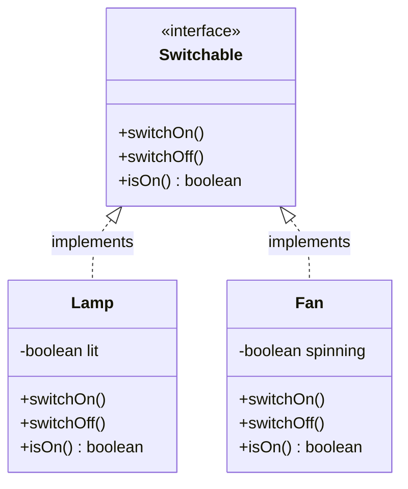

# Lesson 01 — Objects, Encapsulation, and Interfaces

**Phase 0 — OOP Foundations** · **Chapter 01 — The Object-Oriented Toolbox** · **Lesson 01 of the course**

**Kata package:** `com.katas.oopbasics` (and `com.katas.oopbasics.naive` for the wrong-way code)
**Smart Home Hub files created:** `com/smarthome/devices/Device.java`, `Light.java`, `Thermostat.java`; **modified:** `com/smarthome/Main.java`; **test added:** `com/smarthome/devices/DeviceTest.java`
**Prerequisites:** Lesson 00 (a working Java 21 + Maven toolchain).

> This is the foundation lesson. Three ideas — **object**, **encapsulation**, **interface** — hold up everything else in this course. The last one, the interface, is the single most load-bearing idea you will learn. Take your time here; every pattern later leans on it.

---

## SECTION 1 — THE PAIN

Imagine you are asked to write a tiny bank account. You know some Java, so you reach for the most direct thing that could possibly work: a class with a number in it.

```java
class BankAccount {
    public double balance;   // just a number anyone can read or write
}
```

It works. You write `account.balance = 100;` and the money is there. You write `account.balance = account.balance - 30;` and you have made a withdrawal. Job done — until the program grows. Somewhere in a different file, three weeks later, a colleague (or future you) writes `account.balance = -5000;` because of a typo, or a bad calculation, or a refund gone wrong. Nothing stops them. The account is now impossibly overdrawn and **nobody can tell where it happened**, because the balance can be changed from anywhere, by anyone, at any time.

That is the pain: **data with no guard in front of it.** The rule you care about — "an account balance must never go negative" — exists only in your head. It is written down nowhere the computer can enforce. Every single place that touches `balance` has to remember the rule perfectly, forever. The moment one place forgets, the data rots, and the bug could be anywhere.

This lesson is about the tools object-oriented programming gives you to make that whole category of pain impossible. Not "please remember the rule" — but "the rule cannot be broken, because the data will not let you."

---

## SECTION 2 — REAL WORLD ANALOGY

Think about the **front desk of a hotel** and the **key-card machine** behind it.

You, a guest, cannot walk behind the desk and reprogram a key card yourself. There is a counter in the way. If you want a card for room 204, you *ask the receptionist*, and the receptionist follows rules: they check you are actually booked into 204, they check your ID, and only then do they make the card. The machine's guts — the encoder, the room database — are hidden behind the desk. You get a small, safe set of things you are allowed to ask for.

That counter is **encapsulation**. The data (which card opens which room) is hidden; the only way to affect it is by asking through a controlled set of requests, each of which enforces the rules.

Now think about the **request itself**, separate from who fulfils it. "I'd like a key for my room" is a request that makes sense at *any* hotel. A tiny roadside motel with a metal key on a wooden fob, and a giant resort with an app on your phone, both understand it. You don't need to know how each one works inside. You just need them both to honour the same request. That shared, agreed-upon request — "you can ask for a room key" — is an **interface**: a contract many different providers can each fulfil in their own way.

Mapping it to code:

| Hotel | Code |
|---|---|
| The stuff behind the desk (encoder, room DB) | An object's **private fields** (its hidden data) |
| The receptionist enforcing rules | The object's **public methods** (its guarded behaviour) |
| The counter you cannot cross | The boundary **encapsulation** draws around the data |
| "You can ask for a room key" (works at any hotel) | An **interface** (a contract) |
| This specific motel vs. that specific resort | Two **classes** that each **implement** the interface |

---

## SECTION 3 — THE CONCEPTS EXPLAINED

We meet several new words here. Each gets the full treatment, one at a time, in order, so no explanation ever leans on a word you have not met yet.

### 3.1 What an object really is

**Plain definition.** An *object* is a bundle that holds some **data** and the **behaviour** that acts on that data, together in one place.

**Why it exists.** In older styles of programming, data sat in one place and the functions that changed it sat somewhere else entirely. Nothing tied them together, so any function anywhere could scramble any data. Bundling the data with the exact behaviour allowed to touch it means the data and its rules travel together and cannot drift apart.

**Tiny concrete example.** A `BankAccount` object holds the data `balance` *and* the behaviour `deposit(...)` and `withdraw(...)`. You never change the balance directly; you *ask the object* to deposit or withdraw, and the object changes its own balance according to its own rules.

**The name.** This bundling of data and the behaviour that guards it is the heart of what we call an **object**. A *class* is the blueprint; an *object* is one actual thing built from that blueprint. `new BankAccount(100)` builds one object from the `BankAccount` class.

> New term — **class**: the blueprint or template. New term — **object** (also called an **instance**): one concrete thing made from that blueprint. One `BankAccount` class; as many `BankAccount` objects as you build.

### 3.2 Encapsulation

**Plain definition.** *Encapsulation* means hiding an object's data behind its methods, so the data can only be changed by going through behaviour that enforces the rules.

**Why it exists.** To make bad states impossible instead of merely discouraged. If the only door to the balance is `withdraw(...)`, and `withdraw` refuses to overdraw, then the account *cannot* go negative — not because everyone remembered, but because there is no other way in.

**The two tools that make it work** (new keywords, defined now):

- `private` — a field or method marked `private` can be touched *only* by code inside the same class. This is the counter at the hotel desk; outsiders cannot cross it.
- `public` — a field or method marked `public` can be touched by any code anywhere. This is the receptionist you are allowed to talk to.

The recipe for encapsulation is simple and you will use it forever: **make the data `private`, and expose `public` methods that guard it.**

**Tiny concrete example.**

```java
private double balance;                       // hidden: nobody outside can touch it
public void withdraw(double amount) {         // the only guarded door out
    if (amount > balance) throw ...;          // the rule, enforced right here
    balance -= amount;                         // only reached if the rule held
}
```

Two more words that ride along with encapsulation:

> New term — **invariant**: a rule that must *always* be true about an object, for its whole life. "The balance is never negative" is an invariant. Encapsulation is how you *protect* an invariant: you guard every door that could break it.
>
> New term — **constructor**: the special method that runs once when an object is built, whose job is to leave the new object in a valid starting state. It is the *first* door, so it guards the invariant from the very first moment — a `BankAccount` constructor that rejects a negative opening balance means no account is ever born broken.

### 3.3 Interfaces — the load-bearing idea

Here is the most important idea in the entire course. Read it twice.

**Plain definition.** An *interface* is a pure **contract**: a named list of things a class promises it can do, with **no code** for how it does them. It says *what*, never *how*.

**Why it exists.** So that code can depend on *what something can do* rather than *what exact thing it is*. If I write code that only needs "something I can switch on and off," I should not have to care whether it is a lamp, a fan, or a rocket. I depend on the **contract** ("switchable"), and any class that honours the contract slots straight in — including classes that do not exist yet.

Two more words, defined before we use them:

> New term — **contract**: a promise about *what* is provided, with the *how* left open. An interface is a contract written in Java.
>
> New term — **implementation**: the actual working code that fulfils a contract. A `Lamp` class is one implementation of the `Switchable` contract; a `Fan` class is another.
>
> The course's golden rule, which you will hear again and again: **program to an interface, not to an implementation.** Depend on the contract, not on any one concrete class.

**Tiny concrete example.** The contract:

```java
interface Switchable {   // the contract: three promises, no code
    void switchOn();
    void switchOff();
    boolean isOn();
}
```

Two implementations that fulfil it *completely differently*:

```java
class Lamp implements Switchable { ... bulb lights up ... }
class Fan  implements Switchable { ... blades spin ... }
```

And the payoff — one piece of code that drives both, forever, without ever asking which is which:

```java
Switchable[] devices = { new Lamp(), new Fan() };
for (Switchable d : devices) d.switchOn();   // lamp lights, fan spins
```

Notice the variable's *type* is `Switchable` — the contract — not `Lamp` or `Fan`. That is "programming to an interface" in one line.

### 3.4 Polymorphism (the thing that just happened)

**Plain definition.** *Polymorphism* means one call site behaving in many ways, decided by which object is actually there at run time.

**Why it exists.** It is the reward for programming to an interface. Because the loop above calls `d.switchOn()` through the `Switchable` contract, the *right* concrete behaviour — the lamp's or the fan's — is chosen automatically, per object, while the program runs. One call, many behaviours.

**The name.** "Poly" = many, "morph" = shape: one call, many shapes of behaviour. This is **polymorphism**, and we will unpack exactly how the JVM chooses in Lesson 02. For now, hold onto the *feeling*: the loop said `switchOn()` once, and two different things happened, correctly, with no `if`.

### 3.5 The class diagram

Here is the shape of the kata, drawn in **UML** (the diagramming language we will learn to read properly in Lesson 04; for now, read the arrows as "the two classes each promise to fulfil the `Switchable` contract"):



The dashed arrow with the hollow triangle (`<|..`) means "implements a contract." The `-` before a field means `private` (hidden); the `+` before a method means `public` (part of the contract).

---

## SECTION 4 — THE WRONG WAY

**WRONG APPROACH — data with no guard.** Saved as `katas/src/main/java/com/katas/oopbasics/naive/BankAccount.java`:

```java
package com.katas.oopbasics.naive;

public class BankAccount {
    // 'public' means any class anywhere may read AND write this directly,
    // with zero checks. Nothing stops account.balance = -1000000.
    public double balance;
}
```

**What goes wrong as requirements grow.** Today the program only ever adds money. Fine. Next month someone adds withdrawals in three different files. Each of those must remember to check for overdraft. Then a refund feature writes to `balance` directly. Then a "correction" script sets it negative on purpose "just temporarily." There is no single place that owns the rule, so the rule is enforced *nowhere and everywhere at once* — which means, in practice, nowhere. The bug that finally overdraws the account can be in any of a dozen files, and every one of them looks innocent.

**Predicted symptom (a prediction).** This compiles and runs happily — that is exactly the danger. The following is perfectly legal:

```java
BankAccount a = new BankAccount();
a.balance = -5000;              // no error, no complaint, no defence
System.out.println(a.balance);  // prints: -5000.0
```

The compiler is happy. The bank is not. There is no line you can point to and say "this is where the rule should have stopped it," because you never built a place for the rule to live.

---

## SECTION 5 — THE RIGHT WAY (THE KATA)

**CORRECT APPROACH.** The kata puts the rule where it cannot be dodged. Files (all saved to disk):

- `katas/src/main/java/com/katas/oopbasics/BankAccount.java` — encapsulated account (data private, rules guarded).
- `katas/src/main/java/com/katas/oopbasics/Switchable.java` — the interface (contract).
- `katas/src/main/java/com/katas/oopbasics/Lamp.java` and `Fan.java` — two implementations.
- `katas/src/main/java/com/katas/oopbasics/Main.java` — the runnable demo.
- `katas/src/test/java/com/katas/oopbasics/BankAccountTest.java` and `SwitchableTest.java` — the tests.

The full code is on disk with every line commented. The key moves: `balance` is `private`; `withdraw` throws on overdraft; the constructor throws on a negative opening balance; and `Lamp`/`Fan` each `implements Switchable` with their own guts.

### What happens when `Main` runs, step by step

1. `new BankAccount(100)` runs the constructor; 100 is not negative, so the object is built with `balance = 100`.
2. `account.balance()` returns 100 through the read-only window; we print `Opening balance: 100.0`.
3. `account.deposit(50)` checks 50 ≥ 0 (fine), sets balance to 150; we print `150.0`.
4. `account.withdraw(30)` checks 30 ≥ 0 and 30 ≤ 150 (both fine), sets balance to 120; we print `120.0`.
5. `account.withdraw(500)` checks 500 ≤ 120 — **false** — so it throws `IllegalArgumentException("Insufficient funds.")`. The `catch` block catches it and prints the "Blocked bad withdrawal" line. The balance is untouched.
6. We build `Switchable[] devices = { new Lamp(), new Fan() }`, typed as the contract.
7. The loop hits the `Lamp` first: `switchOn()` prints "Lamp: the bulb lights up." and `isOn()` returns true → prints `isOn? true`.
8. The loop hits the `Fan`: the *same* `switchOn()` call prints "Fan: the blades start spinning." and `isOn?` prints `true`. One call, two behaviours — polymorphism.

### Predicted console output (a prediction)

```text
== Encapsulation: the account guards its own rule ==
Opening balance: 100.0
After depositing 50: 150.0
After withdrawing 30: 120.0
Blocked bad withdrawal: Insufficient funds.

== Interfaces: one loop, two very different devices ==
Lamp: the bulb lights up.
  isOn? true
Fan: the blades start spinning.
  isOn? true
```

Run it yourself:

```bash
cd katas
mvn compile exec:java -Dexec.mainClass=com.katas.oopbasics.Main
```

> Run that from `katas/` and check the output matches the prediction above. If it does not, the machine is right — tell me what you saw and we will work out why. (Note: `exec:java` runs whichever `main` you name; the kata project has more than one `Main`, so naming the full class `com.katas.oopbasics.Main` is what points it here.)

### The tests

The tests assert the rules hold: deposit/withdraw math, refused overdraft, refused negative opening balance, and both `Lamp` and `Fan` honouring the `Switchable` contract. Run them:

```bash
cd katas
mvn test
```

**Predicted result (a prediction):** all tests pass — `BUILD SUCCESS`, with the smoke test from Lesson 00 plus the five new checks (three in `BankAccountTest`, two in `SwitchableTest`) all green.

> Run `mvn test` from `katas/` and check it matches. If a test fails instead, the machine wins — paste me what you saw.

---

## SECTION 6 — APPLIED TO THE SMART HOME HUB

This is exactly the moment the hub needs. Everything the hub controls — lights, thermostats, locks, cameras, speakers — is "a thing that can be turned on and off and asked its state." That is a **contract**. If the hub programs to that contract instead of to each concrete gadget, it can gain new device types for years without the core ever changing.

**Files created / modified (all on disk):**

- `smarthome/src/main/java/com/smarthome/devices/Device.java` — the `Device` interface: `name()`, `turnOn()`, `turnOff()`, `isOn()`, `status()`.
- `smarthome/src/main/java/com/smarthome/devices/Light.java` — first implementation (a bulb).
- `smarthome/src/main/java/com/smarthome/devices/Thermostat.java` — second implementation, carrying *extra* state (a target temperature) that `Light` does not have, proving different devices can honour the same contract while keeping their own data.
- `smarthome/src/main/java/com/smarthome/Main.java` — now builds both devices, holds them in a `Device[]`, and drives them through one loop.
- `smarthome/src/test/java/com/smarthome/devices/DeviceTest.java` — the hub's first real regression test.

**What this adds.** The hub now has a real spine: a single `Device` type it talks to. Notice `Main` holds `Device[] devices`, not `Light[]` or a tangle of both. Adding a `Lock` later means writing `Lock implements Device` — and the loop in `Main` keeps working untouched. That "add new types without editing old code" property has a name we will meet formally in Lesson 06 (the Open/Closed Principle); the interface is what makes it possible.

**A numbered trace of the hub running.**

1. `new Light("Living Room Light")` builds a light; the constructor checks the name is not blank, stores it, starts the light off.
2. `new Thermostat("Hall Thermostat", 21)` builds a thermostat; it checks the name, then routes 21 through `setTarget`, which checks 5 ≤ 21 ≤ 35 (fine) and stores it; starts off.
3. `Device[] devices = { light, thermostat }` — both held as the *contract* type.
4. Loop, first object (the light): `turnOn()` sets it on; `status()` returns `"Living Room Light is ON"`; printed with two leading spaces.
5. Loop, second object (the thermostat): the *same* `turnOn()` call sets it regulating; its own `status()` returns `"Hall Thermostat is ON (target 21C)"` — extra detail the light never had — printed the same way.

**Predicted output of the hub's `Main` (a prediction):**

```text
Smart Home Hub is starting up...
  Living Room Light is ON
  Hall Thermostat is ON (target 21C)
```

```bash
cd smarthome
mvn compile exec:java -Dexec.mainClass=com.smarthome.Main
```

**Predicted test result (a prediction):** `mvn test` from `smarthome/` is green — the Lesson 00 smoke test plus the four new `DeviceTest` checks all pass.

> Run both commands from `smarthome/` and compare against the two predictions. If either differs, the machine is right — show me the real output.

---

## SECTION 7 — IN THE WILD

You already use interfaces every time you touch Java's collections. `java.util.List` is an **interface** — a contract that says "an ordered collection you can `add` to, `get` from by index, and ask the `size` of." `ArrayList` and `LinkedList` are two **implementations** with completely different guts (a resizable array vs. a chain of linked nodes), yet you can write:

```java
List<String> names = new ArrayList<>();   // program to the List contract
```

and later change only that one line to `new LinkedList<>()` — the rest of your code, which depends on `List`, never notices. That is "program to an interface, not an implementation" shipped in the standard library you use daily.

For encapsulation: nearly every well-written JDK class hides its fields and exposes guarded methods. `java.lang.String` is a strong example — its internal character data is private and it exposes no setter at all, which is why a `String` can never be changed after it is created (we will call that *immutability* in a later lesson).

*(These are stable, well-known facts about the JDK; still, if you ever want certainty, the class names above are worth confirming in your own IDE by jumping into their source.)*

---

## SECTION 8 — WHEN NOT TO USE IT

Encapsulation is almost never wrong — hiding data and guarding invariants is a default you should reach for every time an object has a rule worth protecting. The honest caution is smaller: do not add *ceremony* that protects nothing. A pure, immutable data-carrier with no rules (say, a 2D `Point` with an `x` and a `y` that are set once and never change) does not need hand-written getters and a wall of boilerplate; Java `record`s exist exactly for that, and reaching for full manual encapsulation there is busywork. Guard invariants fiercely; do not perform guarding theatre where there is no invariant.

**Interfaces** have a realer trap, and you will feel it later: do **not** create an interface for something that has, and will only ever have, **one** implementation. An interface earns its keep when it lets *different* things be treated the same, or lets you swap implementations. A `PaymentServiceInterface` with exactly one `PaymentService` behind it — added "just in case" — is pure indirection: an extra file, an extra hop, an extra thing to open when reading the code, buying nothing. The cost every interface charges is a layer of indirection between the caller and the real work. Pay it when the contract buys you real flexibility (many implementations, or a boundary you will swap or test behind); refuse it when it buys you only the *feeling* of flexibility. "You might need it someday" is not a pain you have — it is a pattern-fever symptom, and this course spends real effort inoculating you against it.

---

## SECTION 9 — RELATIVES AND LOOK-ALIKES

The concepts in this lesson are foundations, not siblings, but two distinctions are worth drawing now so they never blur:

- **Interface vs. class.** A *class* can hold data and working code; you can build objects from it. An *interface* holds neither data nor working method bodies (in the simple form we use) — it is a pure list of promises, and you cannot build an object directly from it. A class is a *thing*; an interface is a *contract about things*.
- **Encapsulation vs. abstraction.** They travel together but are not the same. *Encapsulation* is **hiding the data** so it can only be touched through guarded behaviour. *Abstraction* is **hiding the complexity** behind a simple set of operations — you press "turn on," you do not think about voltage. The interface is the tool of abstraction (it shows you *only* the simple operations); `private` is the tool of encapsulation (it hides the data). We will lean hard on abstraction throughout; hold the word loosely for now — Lesson 04 sharpens it.

---

## SECTION 10 — KEY TAKEAWAYS

1. An **object** bundles data with the behaviour that guards it, so the data and its rules can never drift apart.
2. **Encapsulation** — make fields `private`, expose guarded `public` methods — turns "please remember the rule" into "the rule cannot be broken," and it is how you protect an object's **invariants**.
3. An **interface** is a pure contract: it says *what* a thing can do, never *how*, and many different classes can each **implement** it in their own way.
4. **Program to an interface, not an implementation** — depend on the contract, not on any one concrete class — is the single most load-bearing habit in this course, and nearly every pattern to come is built on it.
5. Both tools have an exit: skip encapsulation ceremony where there is no invariant to protect, and do not invent an interface for something that will only ever have one implementation — indirection you do not need is a cost, not a virtue.

---

## SECTION 11 — CHALLENGE WITH HIDDEN ANSWER

**The challenge.** Add a third device to the Smart Home Hub — a `SmartLock` — that honours the `Device` contract *and* carries its own extra, guarded state: a `boolean locked`, with a `lock()` and `unlock()` method, plus an invariant that **a lock cannot be turned off while it is unlocked** (safety: you should not be able to power down the lock in an open state). Then add it to the array in `Main` and predict the new output. Do **not** change the loop in `Main` — if your design is right, the loop should not need to change at all. That "no change to existing code" is the whole point.

Try it on paper or in code first. The full worked answer is below.

<details>
  <summary>Click to reveal the answer</summary>

**The class** — `smarthome/src/main/java/com/smarthome/devices/SmartLock.java`:

```java
package com.smarthome.devices;

// A third Device: a smart lock. It honours the SAME Device contract as Light
// and Thermostat, so the hub drives it with the exact same loop — no change
// to Main's loop is needed, which is the proof the interface earned its keep.
public class SmartLock implements Device {

    private final String name;   // hidden, set once
    private boolean on;          // is the lock powered / active?
    private boolean locked;      // extra guarded state unique to a lock

    public SmartLock(String name) {
        if (name == null || name.isBlank()) {
            throw new IllegalArgumentException("A lock must have a name.");
        }
        this.name = name;
        this.on = false;
        this.locked = true;      // safest default: born locked
    }

    @Override public String name() { return this.name; }

    @Override public void turnOn() { this.on = true; }

    @Override
    public void turnOff() {
        // The invariant: refuse to power down while standing open.
        if (!this.locked) {
            throw new IllegalStateException("Cannot power off an unlocked lock.");
        }
        this.on = false;
    }

    @Override public boolean isOn() { return this.on; }

    // Extra behaviour beyond the Device contract, each guarded.
    public void lock()   { this.locked = true; }
    public void unlock() { this.locked = false; }
    public boolean isLocked() { return this.locked; }

    @Override
    public String status() {
        return this.name + " is " + (this.on ? "ON" : "OFF")
                + " (" + (this.locked ? "LOCKED" : "UNLOCKED") + ")";
    }
}
```

**The change to `Main`** — only the array grows; the loop is untouched:

```java
Device frontDoorLock = new SmartLock("Front Door Lock");
Device[] devices = { livingRoomLight, hallThermostat, frontDoorLock };
// ... the exact same for-loop as before ...
```

**Predicted output (a prediction):**

```text
Smart Home Hub is starting up...
  Living Room Light is ON
  Hall Thermostat is ON (target 21C)
  Front Door Lock is ON (LOCKED)
```

**Why it matters.** You added a whole new device type and the controlling loop did not change one character. That is programming to the `Device` contract paying off: the hub is *open to new devices* but the code that drives them is *closed to modification*. You just felt the Open/Closed Principle (Lesson 06) before we named it — and it was the interface that made it free. The `turnOff` guard, meanwhile, is encapsulation defending an invariant: the unlocked-lock rule lives in exactly one place and cannot be dodged.

*(This `SmartLock` is the challenge answer only — it is intentionally not part of the committed hub code, so the lesson's file list stays honest. Write it yourself if you want to see it run.)*

</details>

---

## SECTION 12 — CATALOG UPDATE

No `pattern-catalog.md` entry this lesson. The catalog is a cheat-sheet of *principles and patterns*, and its first entry arrives in Lesson 05 (the Single Responsibility Principle). This lesson taught the raw OOP vocabulary those principles are built from — object, encapsulation, interface, polymorphism — which lives in `glossary.md` instead. All four terms were added there this lesson.

---

## SECTION 13 — WHAT IS NEXT

Lesson 02 — **Inheritance and polymorphism**. We will see the *other* way to share behaviour between classes (one class building on another), trace exactly how the JVM picks which method runs at run time, and meet the classic traps — including why "favour composition over inheritance" becomes the drumbeat of Lesson 03.

---

_Lesson 01 of the course · Phase 0 (OOP Foundations) · Chapter 01 (The Object-Oriented Toolbox), Lesson 1 of 4._
